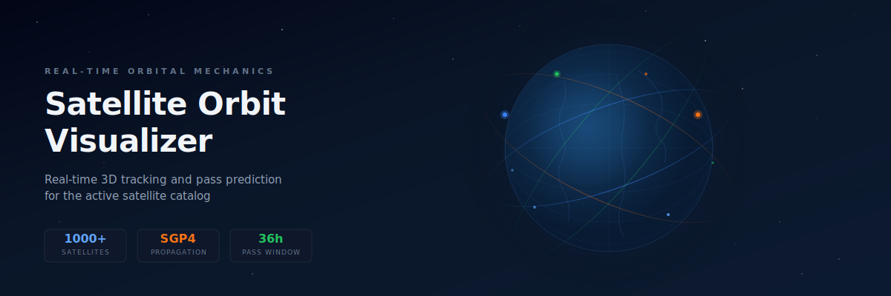
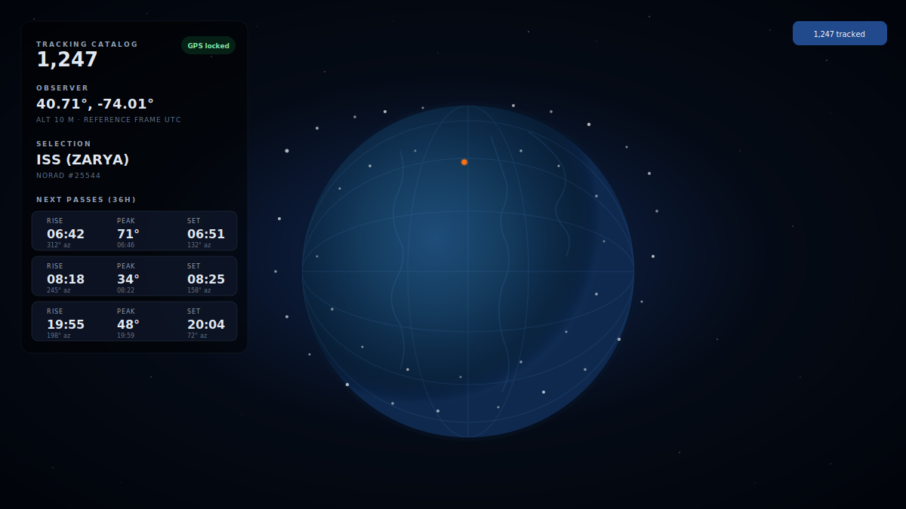
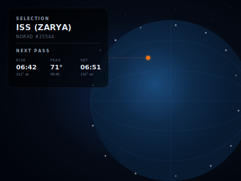
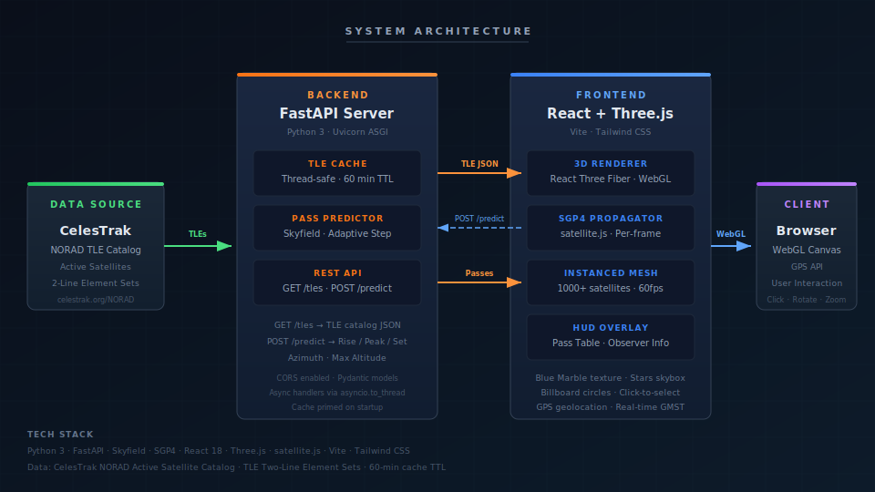
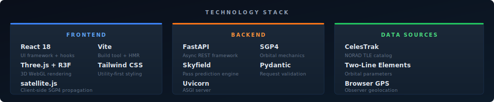

<div align="center">



# Satellite Orbit Visualizer

**Real-time 3D orbital tracking and pass prediction for the active satellite catalog**

Propagate thousands of satellite orbits in real time from cached TLE data, rendered as an interactive 3D globe with per-frame SGP4 position updates and Skyfield-powered pass prediction.

[Features](#features) · [Architecture](#architecture) · [Quick Start](#quick-start) · [API Reference](#api-reference) · [Tech Stack](#tech-stack) · [Project Structure](#project-structure) · [Roadmap](#roadmap) · [Contributing](#contributing)

</div>

---



## Features

- **Interactive 3D Globe** — Blue Marble Earth rendered with React Three Fiber, 2000-star skybox, smooth orbit controls (zoom, rotate)
- **Live Satellite Catalog** — Fetches the active NORAD catalog from CelesTrak, cached for 60 minutes with thread-safe refresh
- **Real-time SGP4 Propagation** — Every satellite position updates each animation frame using `satellite.js`, converting ECI coordinates through GMST to Earth-fixed positions
- **Efficient InstancedMesh Rendering** — Draws the full catalog (1000+ objects) as GPU-instanced billboard circles with click-to-select interaction
- **Pass Prediction Engine** — Backend computes approximate visible pass windows (rise / peak / set times, azimuth, max altitude) over a 36-hour horizon using Skyfield and an adaptive-step algorithm
- **HUD Overlay** — Displays tracking catalog count, observer coordinates with GPS lock status, selected satellite info (name + NORAD ID), and the next 5 predicted passes
- **Automatic Geolocation** — Browser GPS with 8-second timeout, falls back to (0°, 0°) if denied

The main challenge was keeping the rendering performant while tracking thousands of moving objects without freezing the browser.

<div align="center">



*Click any satellite to view its NORAD ID and upcoming pass predictions*

</div>

## Architecture



The system follows a two-tier architecture: a **Python backend** handles TLE catalog management and computationally intensive pass prediction, while the **React frontend** owns all real-time rendering and client-side orbital propagation.

**Data flow:**

1. On startup, the backend fetches the active satellite TLE catalog from CelesTrak and caches it in memory (60-min TTL, thread-safe)
2. The frontend requests the catalog via `GET /tles` and initializes SGP4 satellite records client-side
3. Each animation frame, `satellite.js` propagates every satellite's position using SGP4, converts ECI → ECF via GMST, and updates Three.js `InstancedMesh` matrices
4. When a user clicks a satellite, the frontend sends `POST /predict` with the satellite ID and observer coordinates
5. The backend computes visibility windows using Skyfield's topocentric calculations with an adaptive stepping algorithm (10-min steps far below horizon → 1-min steps when visible), refining rise/set times via linear interpolation
6. Results are displayed in the HUD overlay

## Quick Start

### Prerequisites

- **Python 3.10+** with pip
- **Node.js 18+** with npm

### Backend

```bash
cd backend
pip install -r requirements.txt
uvicorn backend.main:app --reload --host 0.0.0.0 --port 8000
```

The API will be available at `http://localhost:8000`. TLE data is fetched from CelesTrak on first request and cached for 60 minutes.

### Frontend

```bash
cd frontend
npm install
npm run dev
```

The dev server starts at `http://localhost:5173` by default.

### Environment Variables

| Variable | Default | Description |
|---|---|---|
| `VITE_API_URL` | `http://localhost:8000` | Backend API base URL for the frontend |

Set this in a `.env` file in the `frontend/` directory or pass it inline:

```bash
VITE_API_URL=http://localhost:8000 npm run dev
```

## API Reference

### `GET /tles`

Returns the cached TLE catalog from CelesTrak.

**Query Parameters:**

| Parameter | Type | Default | Description |
|---|---|---|---|
| `force_refresh` | `boolean` | `false` | Force re-fetch from CelesTrak |

**Response:**

```json
{
  "fetched_at": "2026-03-29T12:00:00Z",
  "count": 1247,
  "satellites": [
    {
      "name": "ISS (ZARYA)",
      "line1": "1 25544U 98067A ...",
      "line2": "2 25544  51.6400 ...",
      "satellite_number": "25544"
    }
  ]
}
```

### `POST /predict`

Computes the next visible passes for a satellite over an observer location.

**Request Body:**

```json
{
  "satellite_id": "25544",
  "observer_lat": 40.71,
  "observer_lon": -74.01,
  "observer_alt_m": 10.0,
  "max_results": 5
}
```

**Response:**

```json
{
  "satellite_id": "25544",
  "name": "ISS (ZARYA)",
  "requested_at": "2026-03-29T12:00:00Z",
  "passes": [
    {
      "rise_time": "2026-03-29T18:42:00Z",
      "rise_azimuth_deg": 312.45,
      "max_altitude_deg": 71.23,
      "max_altitude_time": "2026-03-29T18:46:00Z",
      "set_time": "2026-03-29T18:51:00Z",
      "set_azimuth_deg": 132.10
    }
  ]
}
```

**Validation:**

| Field | Constraints |
|---|---|
| `observer_lat` | -90.0 to 90.0 |
| `observer_lon` | -180.0 to 180.0 |
| `observer_alt_m` | -430.0 to 10000.0 |
| `max_results` | 1 to 10 |

## Tech Stack



| Layer | Technology | Role |
|---|---|---|
| **3D Rendering** | Three.js + React Three Fiber | WebGL globe, InstancedMesh satellite rendering |
| **Orbital Mechanics (Client)** | satellite.js | Per-frame SGP4 propagation, ECI→ECF conversion |
| **UI Framework** | React 18 | Component architecture, hooks, state management |
| **Styling** | Tailwind CSS | Utility-first dark theme with backdrop blur |
| **Build Tool** | Vite | Fast HMR development, optimized production builds |
| **API Server** | FastAPI + Uvicorn | Async REST endpoints with Pydantic validation |
| **Pass Prediction** | Skyfield | Topocentric calculations, adaptive-step pass finder |
| **Orbital Mechanics (Server)** | SGP4 | Backend satellite propagation for pass computation |
| **Data Source** | CelesTrak | NORAD active satellite TLE catalog |

## Project Structure

```
satellite-orbit-visualizer/
├── backend/
│   ├── main.py              # FastAPI app, routes, request/response models
│   ├── services.py          # SatelliteService: TLE cache, pass prediction engine
│   ├── requirements.txt     # Python dependencies
│   └── tests/
│       └── test_main.py     # API and service unit tests
├── frontend/
│   ├── src/
│   │   ├── App.jsx          # Main component: Earth, SatelliteSwarm, Hud, controls
│   │   ├── main.jsx         # React entry point
│   │   └── index.css        # Tailwind CSS imports
│   ├── index.html           # HTML shell
│   ├── package.json         # Node dependencies and scripts
│   ├── vite.config.js       # Vite build configuration
│   ├── tailwind.config.js   # Tailwind theme extensions
│   └── postcss.config.js    # PostCSS pipeline
├── docs/
│   └── assets/              # README visual assets
└── README.md
```

## Data Sources

This project relies on **CelesTrak** for satellite orbital data:

- **Catalog:** [Active Satellites](https://celestrak.org/NORAD/elements/gp.php?GROUP=active&FORMAT=tle) — NORAD Two-Line Element sets for all active Earth-orbiting objects
- **Format:** Standard TLE (2-line and 3-line variants supported)
- **Refresh:** Cached server-side for 60 minutes; `force_refresh` parameter available
- **Accuracy:** TLE-based SGP4 propagation is accurate to a few kilometers for recent elements. Pass prediction times are approximate (sub-minute accuracy for LEO objects with fresh TLEs)

## Roadmap

Planned improvements — contributions welcome:

- [ ] **Orbit Trails** — Render projected ground tracks and 3D orbit paths
- [ ] **Search & Filter** — Find satellites by name, NORAD ID, or orbit type
- [ ] **Time Warp** — Scrub forward/backward in time to simulate past and future positions
- [ ] **Day/Night Terminator** — Shade the Earth's dark side with a terminator line
- [ ] **Atmosphere Shader** — Atmospheric glow and Rayleigh scattering effect on the globe
- [ ] **Link Budget & SNR Analysis** — Compute signal-to-noise ratios and link margins for communication satellites
- [ ] **Timeline Chart** — Gantt-style visibility timeline for multiple satellites
- [ ] **Mobile-Responsive Layout** — Optimized HUD and controls for touch devices
- [ ] **Docker Compose** — One-command deployment with containerized backend and frontend
- [ ] **CI Pipeline** — Automated testing and linting on pull requests

## Contributing

1. Fork the repository
2. Create a feature branch (`git checkout -b feature/orbit-trails`)
3. Commit your changes
4. Push to the branch and open a Pull Request

Please ensure your changes include appropriate tests and follow the existing code style.

## License

This project is open source. See the repository for license details.
